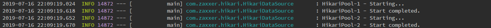
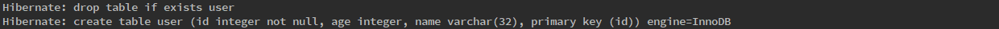
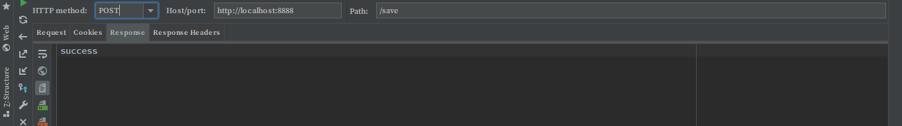
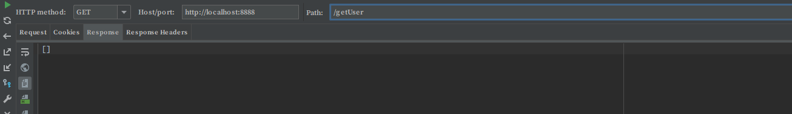

# 简介

Sharding-JDBC 定位为轻量级 Java 框架，在 Java 的 JDBC 层提供的额外服务。 它使用客户端直连数据库，以 jar 包形式提供服务，无需额外部署和依赖，可理解为增强版的 JDBC 驱动，完全兼容 JDBC 和各种 ORM 框架。

* 适用于任何基于 Java 的 ORM 框架，如：JPA, Hibernate, Mybatis, Spring JDBC Template 或直接使用 JDBC

* 基于任何第三方的数据库连接池，如：DBCP, C3P0, BoneCP, Druid, HikariCP 等

* 支持任意实现JDBC规范的数据库。目前支持 MySQL，Oracle，SQLServer 和 PostgreSQL


# 前言

本例只是简单实现了 Sharding-JDBC 中的读写分离功能，请注意。

所用到的技术栈及版本：

* SpringBoot 2.1.6.RELEASE

    * Spring Data JPA

    * Spring Boot Starter Web

    * Spring Boot Starter Test

    * Spring Boot Configuration Processor

    * HikariDataSource（内置）

    * Gson 2.8.5

    * lombok 1.18.8

    * mysql-connector-java 8.0.16

* sharding-jdbc-core 2.0.3

# 配置

新建两个数据库分别为master和slave

* 为slave库建表（master库的表由程序创建）

    ```ddl
    CREATE TABLE `user` (
    `id` int(11) NOT NULL,
    `age` int(11) DEFAULT NULL,
    `name` varchar(32) DEFAULT NULL,
    PRIMARY KEY (`id`)
    ) ENGINE=InnoDB DEFAULT CHARSET=utf8;
    ```

新建config文件夹

* 配置文件 application.yml

    ```yml
    # JPA
    spring:
    jpa:
        show-sql: true
        database-platform: org.hibernate.dialect.MySQL5InnoDBDialect
        hibernate:
        ddl-auto: create

    # Server
    server:
    port: 8888

    # Sharing JDBC
    sharding:
    jdbc:
        data-sources:
        ds_master:
            type: com.zaxxer.hikari.HikariDataSource
            driver-class-name: com.mysql.cj.jdbc.Driver
            jdbc-url: jdbc:mysql://192.168.0.120:3306/master?characterEncoding=utf8&useSSL=false
            username: root
            password: wangBin_123
        ds_slave:
            type: com.zaxxer.hikari.HikariDataSource
            driver-class-name: com.mysql.cj.jdbc.Driver
            jdbc-url: jdbc:mysql://192.168.0.120:3306/slave?characterEncoding=utf8&useSSL=false
            username: root
            password: wangBin_123
        master-slave-rule:
        name: ds_ms
        master-data-source-name: ds_master
        slave-data-source-names: ds_slave
        load-balance-algorithm-type: round-robin
    ```

    使用SpringBoot默认的数据库连接池HikariDataSource

    * load-balance-algorithm-type：
        查询时的负载均衡算法，目前有2种算法，round_robin（轮询）和random（随机）

    * master-data-source-name： 主数据源名称

    * slave-data-source-names： 从数据源名称 多个用逗号隔开

* 存放数据源数据：ShardingMasterSlaveConfig.java

    ```java
    package top.soliloquize.read_write_separation.config;

    import com.zaxxer.hikari.HikariDataSource;
    import io.shardingjdbc.core.api.config.MasterSlaveRuleConfiguration;
    import lombok.Data;
    import org.springframework.boot.context.properties.ConfigurationProperties;

    import java.util.HashMap;
    import java.util.Map;

    /**
    * @author wb
    * @date 2019/7/16
    * 存放数据源
    */
    @Data
    @ConfigurationProperties(prefix = "sharding.jdbc")
    public class ShardingMasterSlaveConfig {

        private Map<String, HikariDataSource> dataSources = new HashMap<>();

        private MasterSlaveRuleConfiguration masterSlaveRule;
    }

    ```

* 配置数据源：ShardingDataSourceConfig.java

    ```java
    package top.soliloquize.read_write_separation.config;

    import com.zaxxer.hikari.HikariDataSource;
    import io.shardingjdbc.core.api.MasterSlaveDataSourceFactory;
    import org.slf4j.Logger;
    import org.slf4j.LoggerFactory;
    import org.springframework.beans.factory.annotation.Autowired;
    import org.springframework.boot.autoconfigure.condition.ConditionalOnProperty;
    import org.springframework.boot.context.properties.EnableConfigurationProperties;
    import org.springframework.context.annotation.Bean;
    import org.springframework.context.annotation.Configuration;

    import javax.sql.DataSource;
    import java.sql.SQLException;
    import java.util.HashMap;
    import java.util.Map;

    /**
    * @author wb
    * @date 2019/7/16
    * 配置数据源详细信息
    */
    @Configuration
    @EnableConfigurationProperties(ShardingMasterSlaveConfig.class)
    @ConditionalOnProperty({"sharding.jdbc.data-sources.ds_master.jdbc-url",
            "sharding.jdbc.master-slave-rule.master-data-source-name"})
    public class ShardingDataSourceConfig {

        private static final Logger log = LoggerFactory.getLogger(ShardingDataSourceConfig.class);

        @Autowired(required = false)
        private ShardingMasterSlaveConfig shardingMasterSlaveConfig;

        /**
        * 配置数据源
        *
        * @return
        * @throws SQLException
        */
        @Bean("dataSource")
        public DataSource masterSlaveDataSource() throws SQLException {
            shardingMasterSlaveConfig.getDataSources().forEach((k, v) -> configDataSource(v));
            Map<String, DataSource> dataSourceMap = new HashMap<>();
            dataSourceMap.putAll(shardingMasterSlaveConfig.getDataSources());
            DataSource dataSource = MasterSlaveDataSourceFactory.createDataSource(dataSourceMap,
                    shardingMasterSlaveConfig.getMasterSlaveRule(), new HashMap<>());
            log.info("masterSlaveDataSource config complete！！");
            return dataSource;
        }

        /**
        * 可添加数据源一些配置信息
        *
        * @param dataSource
        */
        private void configDataSource(HikariDataSource dataSource) {
            dataSource.setMaximumPoolSize(20);
            dataSource.setMinimumIdle(5);
        }
    }

    ```

# 项目结构

* 新建entity文件夹，新建文件UserEntity.java

    ```java
    package top.soliloquize.read_write_separation.entity;

    import lombok.AllArgsConstructor;
    import lombok.Data;
    import lombok.NoArgsConstructor;

    import javax.persistence.Column;
    import javax.persistence.Entity;
    import javax.persistence.Id;
    import java.io.Serializable;

    /**
    * @author wb
    * @date 2019/7/16
    * 测试用户类
    */
    @AllArgsConstructor
    @NoArgsConstructor
    @Data
    @Entity(name = "user")
    public class UserEntity implements Serializable {

        /**
        *
        */
        private static final long serialVersionUID = -6171110531081112401L;
        @Id
        private int id;
        @Column(length = 32)
        private String name;
        @Column(length = 16)
        private int age;

    }

    ```

* 新建dao文件夹，新建文件UserRepository.java

    ```java
    package top.soliloquize.read_write_separation.dao;

    import org.springframework.data.jpa.repository.JpaRepository;
    import top.soliloquize.read_write_separation.entity.UserEntity;

    /**
    * @author wb
    * @date 2019/7/16
    */
    public interface UserRepository extends JpaRepository<UserEntity, Integer> {

    }
    ```

* 新建文件夹service,新建文件UserService.java

    ```java
    package top.soliloquize.read_write_separation.service;

    import top.soliloquize.read_write_separation.entity.UserEntity;

    import java.util.List;

    /**
    * @author wb
    * @time 2019/7/16
    */
    public interface UserService {
        void saveUser(UserEntity user);

        List<UserEntity> getUsers();

    }

    ```

* 新建文件夹service/impl，新建文件UserServiceImpl.java

    ```java
    package top.soliloquize.read_write_separation.service.impl;

    import org.springframework.beans.factory.annotation.Autowired;
    import org.springframework.stereotype.Service;
    import top.soliloquize.read_write_separation.dao.UserRepository;
    import top.soliloquize.read_write_separation.entity.UserEntity;
    import top.soliloquize.read_write_separation.service.UserService;

    import java.util.List;

    /**
    * @author wb
    * @date 2019/7/16
    */
    @Service
    public class UserServiceImpl implements UserService {
        @Autowired
        private UserRepository userRepository;

        @Override
        public void saveUser(UserEntity user) {
            userRepository.save(user);
        }

        @Override
        public List<UserEntity> getUsers() {
            return userRepository.findAll();
        }
    }

    ```

* 新建文件夹controller，新建文件UserController.java

    ```java
    package top.soliloquize.read_write_separation.controller;

    import com.google.gson.Gson;
    import org.springframework.beans.factory.annotation.Autowired;
    import org.springframework.web.bind.annotation.GetMapping;
    import org.springframework.web.bind.annotation.PostMapping;
    import org.springframework.web.bind.annotation.RestController;
    import top.soliloquize.read_write_separation.entity.UserEntity;
    import top.soliloquize.read_write_separation.service.UserService;

    import java.util.List;

    /**
    * @author wb
    * @date 2019/7/16
    * 用户测试类控制器
    */
    @RestController
    public class UserController {

        @Autowired
        private UserService userService;

        @PostMapping("/save")
        public String saveUser() {
            UserEntity user = new UserEntity(1, "张三", 22);
            userService.saveUser(user);
            return "success";
        }

        @GetMapping("/getUser")
        public String getUsers() {
            List<UserEntity> users = userService.getUsers();
            return new Gson().toJson(users);
        }

    }


    ```

# 启动



两个数据源启动完成



程序启动user表重建

# 测试

* 测试master库写入数据

    

* 测试slave库读取数据

    

    就应该没有数据，因为并没有向slave库写入数据


